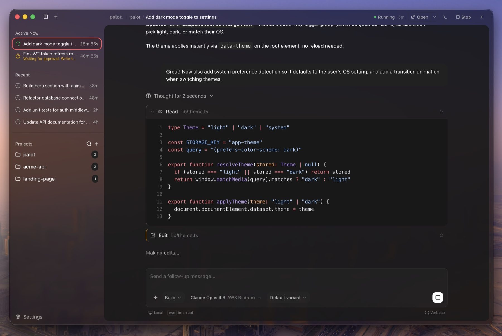

<picture>
  <source media="(prefers-color-scheme: dark)" srcset="apps/desktop/resources/brand/lockup-dark.png">
  <source media="(prefers-color-scheme: light)" srcset="apps/desktop/resources/brand/lockup-light.png">
  
</picture>

### A desktop GUI for [OpenCode](https://opencode.ai)

[](https://github.com/ItsWendell/palot/actions/workflows/ci.yml)
[](https://github.com/ItsWendell/palot/actions/workflows/release.yml)
[](https://github.com/ItsWendell/palot/releases)
[](https://github.com/ItsWendell/palot/releases)
[](LICENSE)

> **Alpha Software** -- Palot is under active development. Expect breaking changes, missing features, and rough edges. Feedback and contributions are welcome!

<p align="center">
  
</p>

---

## What is Palot?

Palot is an open-source Electron app that gives [OpenCode](https://opencode.ai) a full desktop interface. OpenCode is a powerful terminal-based AI coding agent, but it runs one project at a time and lives in the terminal. Palot wraps it with a visual UI so you can manage multiple projects and sessions from a single window, see rich tool call output, and interact with agents without leaving your editor.

Palot spawns and manages the OpenCode server automatically, streams responses in real time, and renders tool calls with syntax-highlighted diffs, file previews, and terminal output.

<br>

## Features

- **Multi-project workspace** -- Manage AI sessions across all your projects from a single window. OpenCode is scoped to one project per instance; Palot lifts that limitation.

- **Full chat interface** -- Conversational UI with real-time SSE streaming, Markdown rendering, auto-scroll, lazy-load pagination, and draft persistence across session switches.

- **Rich tool call visualization** -- Every tool call is rendered inline:
  - File reads with line numbers and syntax highlighting
  - Edits as inline diffs (old vs new)
  - Bash commands with ANSI-colored terminal output
  - Search results (glob, grep) with matched patterns
  - Web fetches with URL and content preview
  - Task lists with real-time progress tracking

- **Sub-agent cards** -- Live activity cards for delegated tasks, with collapsible child session views and automatic collapse on completion.

- **Model and agent selector** -- Searchable model picker across all connected providers (Anthropic, OpenAI, Google, and more), with reasoning variant support and a "last used" section. Switch between available agents (code, build, etc.).

- **Permission management** -- Inline approve/deny UI for agent permission requests, with "allow once" and "allow always" options.

- **Interactive questions** -- Radio, checkbox, and free-text input for agent questions, with keyboard shortcuts.

- **File attachments** -- Drag-and-drop images (PNG, JPEG, GIF, WebP) and PDFs into the chat, with model capability warnings.

- **Command palette** -- `Cmd+K` to search sessions, switch projects, and create new chats.

- **Auto-updates** -- Built-in update mechanism with download progress and one-click restart.

<br>

## Download

| Platform | Architectures | Formats |
|----------|---------------|---------|
| macOS | Apple Silicon, Intel | DMG, ZIP |
| Windows | x64, ARM64 | NSIS installer |
| Linux | x64 | AppImage, DEB, RPM |

Download the latest release from the [Releases page](https://github.com/ItsWendell/palot/releases).

### macOS: unsigned app warning

Palot is not yet code-signed or notarized. macOS Gatekeeper will block the app on first launch with a message like *"Palot is damaged and can't be opened"* or *"Apple could not verify Palot"*. To fix this:

**Option A** -- Right-click (or Control-click) the app in Finder and select **Open**, then click **Open** in the dialog.

**Option B** -- Remove the quarantine attribute from the terminal:

```bash
xattr -cr /Applications/Palot.app
```

This is expected behavior for unsigned apps and does not indicate malware.

<br>

## Getting Started

### From a release (recommended)

1. Download and install from the [Releases page](https://github.com/ItsWendell/palot/releases)
2. Make sure [OpenCode CLI](https://opencode.ai) is installed (`~/.opencode/bin/opencode`)
3. Palot will automatically manage the OpenCode server

> OpenCode needs at least one AI provider configured (Anthropic, OpenAI, Google, etc.). Run `opencode` in a terminal once to complete initial setup.

### Configuration

Palot is a GUI layer on top of OpenCode, so core configuration like model providers, MCP servers, custom tools, and agent behavior is managed through OpenCode's own config files. Refer to the [OpenCode documentation](https://opencode.ai/docs) for setup instructions.

### From source

**Prerequisites:** [Bun](https://bun.sh) 1.3.8+ and [OpenCode CLI](https://opencode.ai)

```bash
git clone https://github.com/ItsWendell/palot.git
cd palot
bun install

# Run the Electron app
cd apps/desktop && bun run dev
```

#### Browser-only mode (no Electron)

For frontend development without Electron:

```bash
# Terminal 1: Start the backend
cd apps/server && bun run dev     # port 3100

# Terminal 2: Start the renderer
cd apps/desktop && bun run dev:web  # port 1420
```

<br>

## Architecture

```
apps/
  desktop/       Electron 40 + Vite + React 19 desktop app
  server/        Bun + Hono backend (browser-mode dev only)
packages/
  ui/            Shared shadcn/ui component library (@palot/ui)
  configconv/    Universal agent config converter (Claude Code, Cursor, OpenCode)
  configconv-cli/ CLI wrapper for the config converter
```

The desktop app has three runtime contexts:

- **Main process** (Node.js) -- Window management, IPC handlers, OpenCode server lifecycle
- **Preload** -- Secure bridge exposing `window.palot` API via `contextBridge`
- **Renderer** (Chromium) -- React app with components, hooks, services, and Jotai atoms

<br>

## Tech Stack

| Layer | Technology |
|-------|-----------|
| Desktop shell | Electron 40, electron-vite |
| Frontend | React 19, Vite 6, TypeScript |
| Styling | Tailwind CSS v4 |
| State | Jotai |
| Routing | TanStack Router |
| UI components | shadcn/ui, Radix, cmdk |
| Code highlighting | Shiki |
| Diff rendering | @pierre/diffs |
| AI integration | @opencode-ai/sdk |
| Monorepo | Turborepo + Bun workspaces |
| Linting | Biome |
| Packaging | electron-builder |
| Versioning | Changesets |

<br>

## Commands

```bash
# Development
bun run dev              # Electron dev mode (from apps/desktop)
bun run dev:web          # Browser-only dev mode (from apps/desktop, needs apps/server)

# Build and package
bun run build            # Production build
bun run package          # Package for current platform
bun run package:all      # Package for all platforms

# Quality
bun run lint             # Lint with Biome
bun run lint:fix         # Lint and auto-fix
bun run check-types      # Type-check all packages

# Testing
cd packages/configconv && bun test   # Run tests

# Versioning
bun changeset            # Add a changeset
bun run version-packages # Apply changesets and bump versions
```

<br>

## Contributing

Palot is in early alpha and we welcome contributions! Here's how to get started:

1. Fork the repository
2. Create a feature branch (`git checkout -b feature/my-feature`)
3. Make your changes
4. Run quality checks: `bun run lint && bun run check-types`
5. Add a changeset: `bun changeset`
6. Open a pull request

Please see the [AGENTS.md](AGENTS.md) file for code style conventions, naming patterns, and important architectural notes.

<br>

## Acknowledgments

Palot is built on top of [OpenCode](https://github.com/opencode-ai/opencode), an open-source AI coding agent. Palot communicates with the OpenCode server via the [`@opencode-ai/sdk`](https://www.npmjs.com/package/@opencode-ai/sdk) package.

The UI component library is built with [shadcn/ui](https://ui.shadcn.com/), [Radix UI](https://www.radix-ui.com/), and [Tailwind CSS](https://tailwindcss.com/).

See [THIRD-PARTY-NOTICES.md](THIRD-PARTY-NOTICES.md) for a full list of third-party dependencies and their licenses.

<br>

## License

[MIT](LICENSE)
